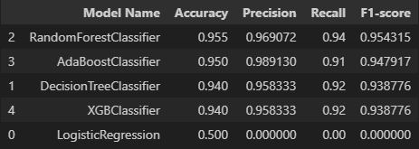
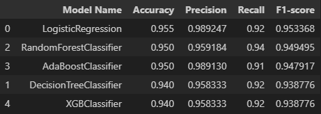
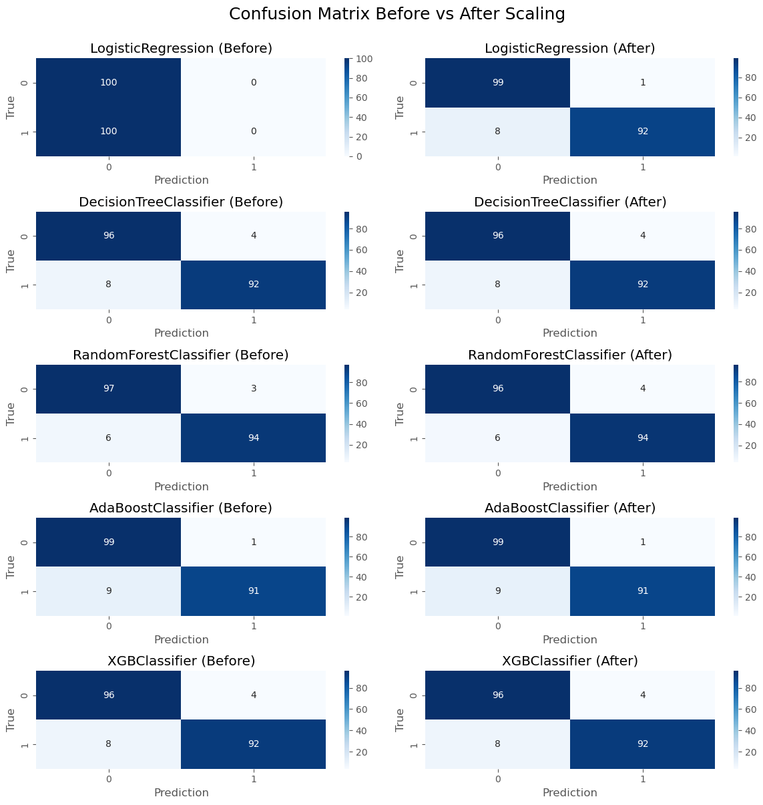

# Predict Customer Clicked Ads Classification by Using Machine Learning
This project is part of Rakamin Academy's portfolio building. In this project, I am given a dataset about a customer database from a company. This company wants to evaluate the effectiveness of their ads. The goal of this project is to make a machine learning model to solve this company's problem in their marketing effort. 

## Customer Type and Behaviour Analysis on Advertisement
For the first step, I did some quick EDA to analyze the company's customerbase. For this project, the focus on the behaviour analysis will be mostly using the numerical features **Age**, **DailyTimeOnSite**, and **DailyNetUsage**.
The EDA consists of univariate, bivariate, and multivariate analysis. Here are some findings and observations made from these EDA:
- Customers who didn't click on ad are mostly 35 years old or younger
- Customers who spends more time on the internet in general is less likely to click on ad
- Time spent on site is part of internet usage (possible redundancy)
- There is a negative correlation between age and time spent

## Data Cleaning & Preprocessing
In this step, I did some preparation for machine learning by doing data cleaning and preprocessing. Here are the overview of what i did in this step:
- Data Cleaning
- Data Splitting
- Data Transformation and Engineering

### Data Cleaning
In this step, I did another quick overview towards the data at hand. The objective for this step is to prepare the data before splitting it into train and test dataset. Fortunately, there is no duplicates found in this dataset. However there are some missing values and columns datatype that might not be suitable for certain machine learning models. While tree based model might be able to handle categorical values, some algorithm like logistic regression might not be able to. Thus to open for more options in machine learning model, some encoding needs to be done for some columns that already have binary values in 'object' datatype.

Here are the summary of what I did in data cleaning:
- Filling missing values in **DailyTimeOnSite**, **AreaIncome**, **DailyNetUsage**, and **Male** columns based on their distributions
- Validating **Timestamp** column by changing its datatype into datetime
- Extracted year, month, week, and day from **Timestamp**
- Changing values of **Male** to represent binary values
- Changing values of **AdClick** to represent binary values

### Data Splitting
After cleaning the dataset, the data is mostly ready for splitting. The target columns for this dataset will be **AdClick** since the objective was to evaluate ad's effectiveness. After separating target and features, I split the data with 80:20 ratio of train and test dataset. Train-test split is done before further encoding as an attempt to reduce data leakage probability by only fitting to train dataset.

### Feature Encoding
After splitting is done, categorical features will be encoded. While tree based algorithm allows categorical features to be processed, I will still do features encoding to accomodate algorithm like logistic regression. Due to the amount of unique values on 3 categorical columns, **city** will be dropped before applying One-Hot Encoding.

## Machine Learning Modeling
For this project, I explicitly didn't transform my features before running the first modeling experiment. This is done to observe the effects of features' scales towards some models. For this project, I used 5 different classification models, such as:
1. Logistic Regression
2. Decision Tree
3. Random Forest
4. AdaBoost
5. XGBoost

These models will be evaluated with Accuracy score as the focus metrics. Without additional data, the assumption I used for this decision is that the cost between False Positive and False Negative prediction is not significant. Due to that, it's better to focus on focusing both True Positive and True Negative using accuracy instead.

After running each models twice, without and with feature scaling, only Logistic Regression has gotten significant improvement towards its performance. It's concluded that tree based models don't require feature scaling.

Here is the performance summary before scaling:

Here is the performance summary after scaling:

Here is the comparison between before and after scaling using confusion matrix:

Based on the graph above, some takeaways will be:
- Age is by far the most important feature in determining whether someone click on ads or not
- Customers from Bali and Sumatera Selatan are more likely to click
- The month when ads run increases the likelihood for customers to click

## Business Recommendations
Based on 3 insights before, I did some EDA to gather additional insight before giving recommendations. Unfortunately, there is no significant impact found regarding the effect of customers' province towards ads click rate. That being said, here are the recommendations to maximize ads click rate:
- Personalize ads towards customers between age 40 and 60
- Run special campaign on February or May