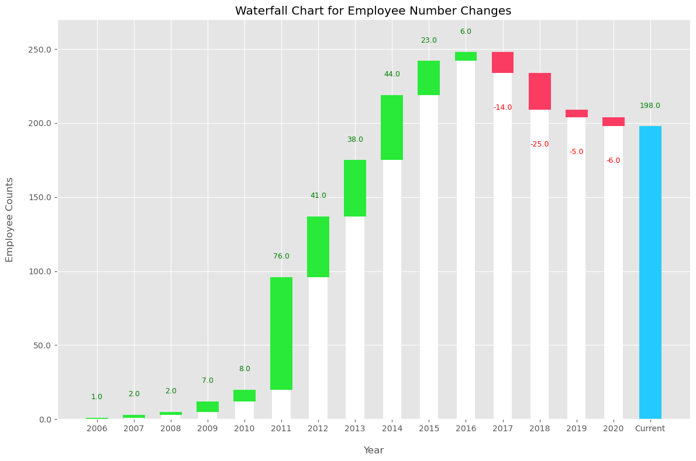
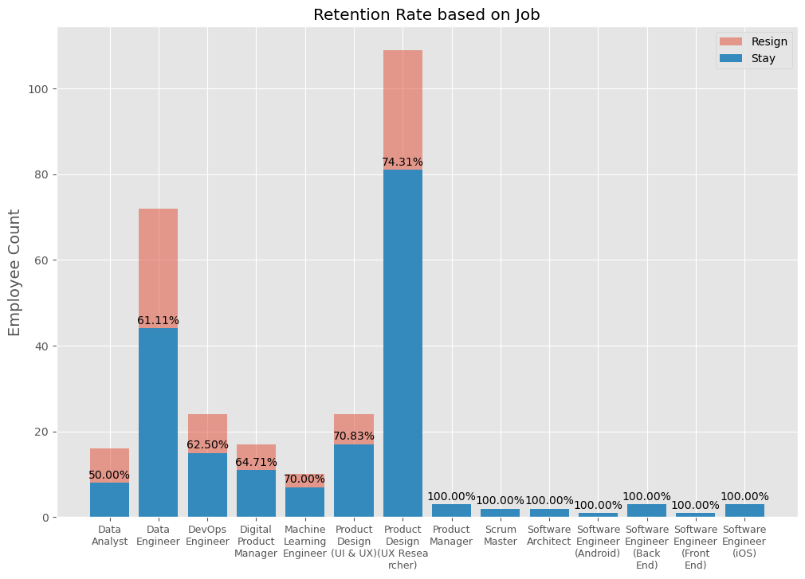
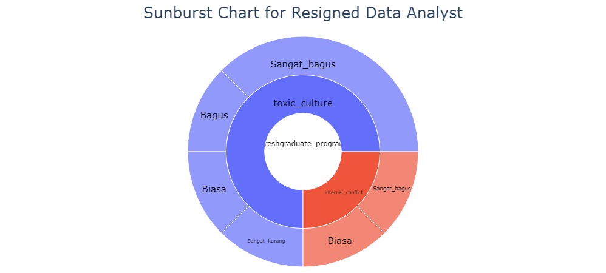

# Improving Employee Retention by Predicting Employee Attrition Using Machine Learning
This project is part of Rakamin Academy's portfolio building. In this project, I am given a dataset about an employee database from a company. This company is dealing with a high attrition rate on their employees. The goal of this project is to analyze and predict resignation behaviour using machine learning model. The expected output will be to make business recommendations utilizing the resulting prediction.

## Data Preprocessing
The data consists of 287 rows of unique employees. There are some problematic values that will be handled in this step. The summary of what's done for this step will be listed below.

### Handling Missing Values
Based on descriptive analysis, here are the method in handling missing values on these columns:
- **SkorKepuasanPegawai** will be filled with mode
- **JumlahKeikutsertaanProjek** will be filled with 0
- **JumlahKeterlambatanSebulanTerakhir** will be filled with 0
- **JumlahKetidakhadiran** will be filled with 0
- **IkutProgramLOP** will be filled with 0
- **AlasanResign** will be filled with 'masih_bekerja'

### Standardizing Values
Based on descriptive analysis, here are the method in standardizing values on these columns:
- **StatusPernikahan**: '-' will be merged to 'Lainnya'
- **PernahBekerja**: 'yes' will be combined to '1'
- **TanggalResign**: '-' as the values indicating that employees are still working will be replaced with an arbitrary date of '2100-1-1'

## Annual Report on Employee Number Changes
Employee number changes will be analyzed by calculating total employees every year to see the changes due to hiring and resigning of employees. The summary for employee number changes can be seen on the graph below:

Based on the graph above, here are the summary:
- Worst turnover can be observed at year 2018 with 11.29% turn over rate that's higher than 10% for [industry average turnover rate](https://www.linkedin.com/business/talent/blog/talent-strategy/industries-with-the-highest-turnover-rates#:~:text=compared%20with%20the%20overall%20average%20of%2010.6%25)
- The upward trend on employment rate might be attributed to the [growing amount of data worldwide](https://www.nasdaq.com/articles/a-decade-of-change%3A-how-tech-evolved-in-the-2010s-and-whats-in-store-for-the-2020s#:~:text=AI%20and%20Big%20Data%20Took%20Off) benefiting tech companies
- The slowing down of employment rate on 2015 and 2016 might be attributed to the company's [resource maturity](https://www.upwork.com/resources/stages-of-business-growth#resource-maturity:~:text=After%20a%20successful%20take%2Doff%20where%20the%20company%20has%20achieved%20the%20rapid%20growth%20it%20aimed%20for%2C%20the%20main%20concern%20of%20businesses%20entering%20the%20resource%20maturity%20stage%20is%20proper%20management%20of%20the%20financial%20gains%20from%20the%20last%20phase).
- The downward trend on year 2017 might be attributed to change in [world economy](https://money.cnn.com/2017/12/28/news/economy/jobs-2017/index.html#:~:text=Another%20sign%20of,plenty%20of%20options.)

## Resign Reason Analysis for Employee Attrition Management Strategy
Resign reason analysis will be done to understand the reason behind the increasing turnover rate since year 2017. As a starting point to understand the resigning reasons, I will be observing turnover rate based on job roles in the company.

Based on the graph above, it can be observed that 'Data Analyst' has the highest turn over rate in this company at 50%. I will be focusing on getting a better understanding towards turnover rate in Data Analyst role.

Based on the sunburst chart above, here are the findings from Data Analyst turnover data:
- All of the resigned Data Analysts are in freshgraduate program
- For reasoning behind resignation, 75% answered 'toxic culture' while 25% answered 'internal conflict'
- Only 1 resigned Data Analysts is underperforming, while the other majority performs rather well

Here are the recommendations towards solving this problem:
- Reevaluate the company's leadership structure
- Fascilitate a safe space for employees to speak their concerns and act on it