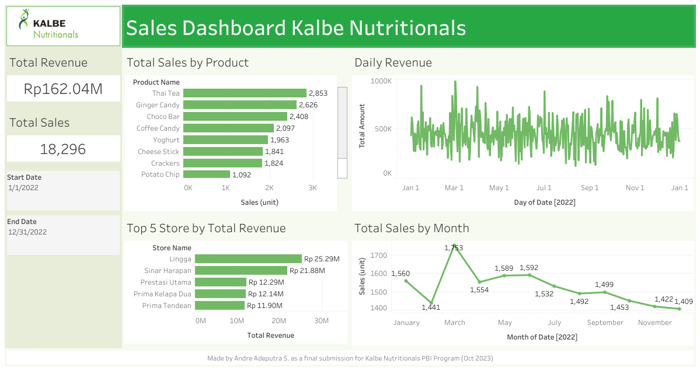
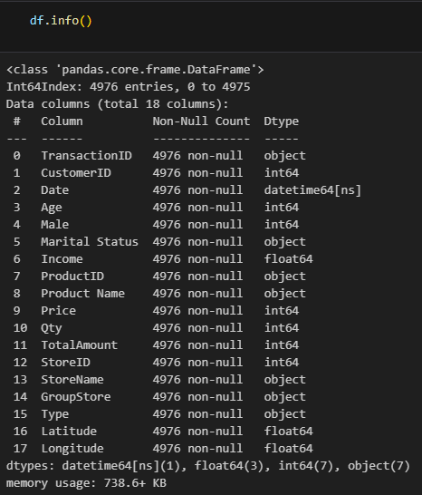
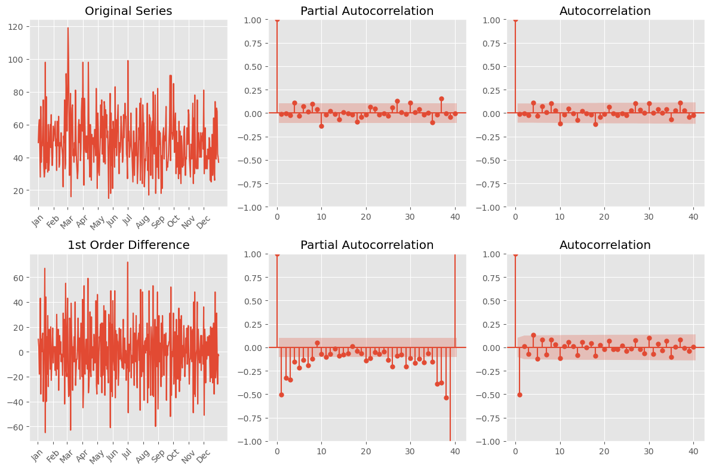
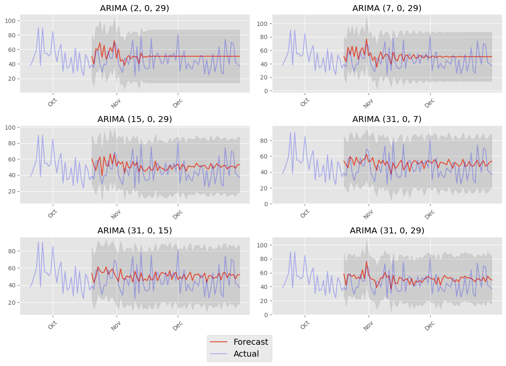
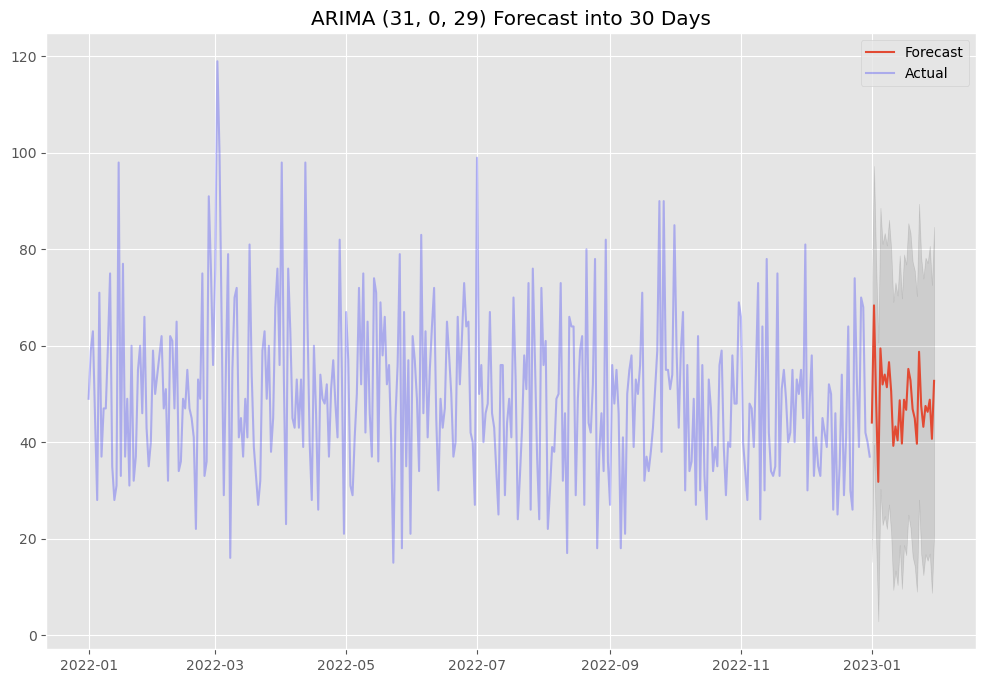
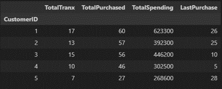
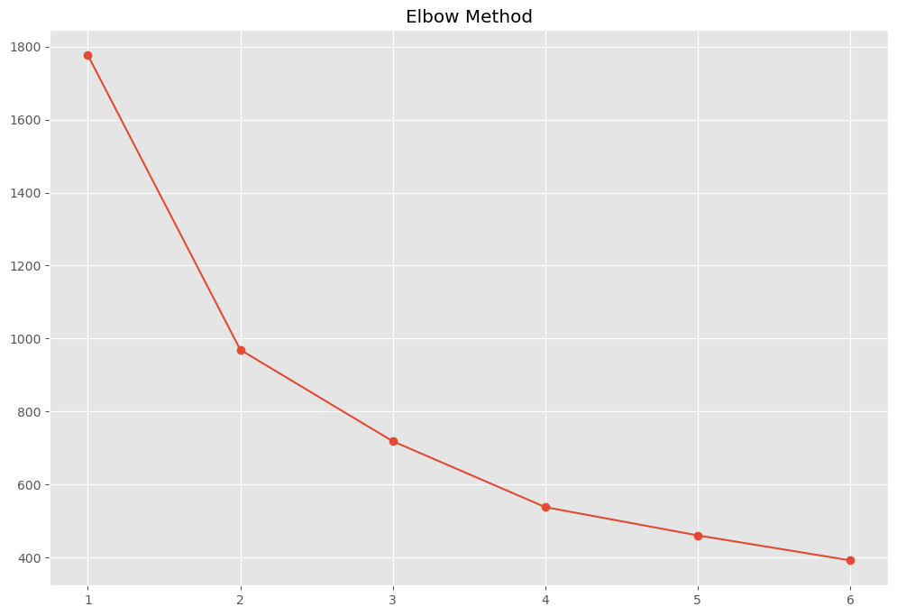
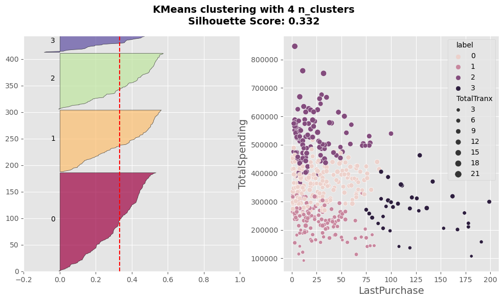
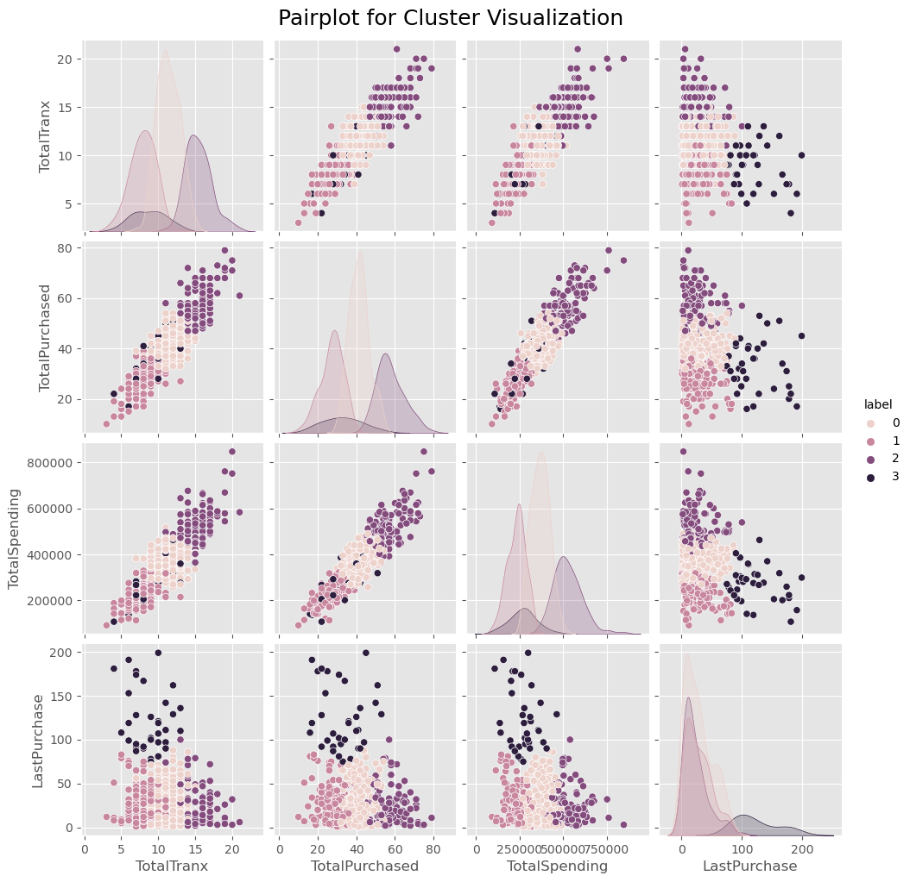

# Kalbe Nutritionals - Machine Learning Project

This project is a part of Project Based Internship Program between Rakamin Academy and Kalbe Nutritionals. In this project, I am given the role as a data scientist in Kalbe Nutritionals. I am provided with 4 files from sales database to use for this project. The goals for this project are as follow:
1. **Product quantity prediction**: Inventory department requested for total sales prediction for all products to make sure they have enough stock available daily
2. **Customer Segmentation**: Marketing department requested for clustering model to help make customer segmentations for personalized promotion and sales treatment in the future 

## Task Breakdown
Here are the overview for this project's requirements from Kalbe Nutritionals
1. Data ingestion and EDA using PostgreSQL (will not be covered in this repository)
2. Dashboard creation using Tableau
3. Time series analysis for sales quantity prediction using ARIMA model
4. Clustering model for customer segmentation using Kmeans Clustering

## Tableau Dashboard

Feel free to check the complete dashboard [here](https://public.tableau.com/app/profile/andre.adeputra/viz/DashboardVIXKalbeNutritionals/Dashboard1).

## Machine Learning Preparations
As preparation for task 3 and 4, it's necessary to compile 4 csv files into 1 complete dataframe. Here are the summary done for this steps:
- Read data from csv
- Clean marital status data by removing null values
- Change ‘Gender’ column into ‘Male’ for better interpretability with its values
- Clean up numeric columns from using comma to period as decimal separators
- Merge all 4 data into 1 dataframe

Here are the resulting main dataframe for the next steps:

## Sales Quantity Prediction

### Data Preparation
Before time series analysis can be done, the complete dataframe will need some preparations to change it into time series data. For that, sales quantity data is groupped by date columns to form a 365 rows of quantity data representing each days of year 2022. Time series data is checked for stationarity using ADFuller and KPSS, the data pass ADFuller without differencing, while only pass KPSS after 1 order of differencing. With that as consideration, PACF and ACF analysis will be done on 0th and 1st order of differencing.

Here are the PACF and ACF analysis:

### ARIMA Modeling
After the analysis, the d term of ARIMA model is determined to be 0, while the p and q terms are determined empirically from visualization test. Here are some of the most notable results:

Based on several consideration, the selected model will be ARIMA (31, 0, 29). Here are it's prediction projection 30 days into year 2023:

### Results and Recommendations
Using the prediction based on graph above, the model predicted that the average daily quantity of products per day is 48, or 1440 products in the next 30 days. Based on that, here are the recommendations to consider:
- Prepare 144-150 stocks of each products and refresh said number of stocks every months
- Do further analysis for quantity sold rate of each products

## Customer Segmentation

### Data Preparation
Before clustering can be done, the complete dataframe will need some preparations to fit into the requirements provided by marketing department. The features required by marketing department are related to RFM analysis. These features are total transactions, total products purchased, and total spending. To complete the RFM component, I added the recency component by extracting total day since last transaction with 1 January 2023 as the date cutoff.

Here are how the data look like:

### Determining Optimal Cluster
To determine optimal cluster, elbow method is used as starting point.

Based on the graph and intertia value analysis, n_clusters 3 and 4 are the possibly candidates. As additional test to determine between these two, silhouette analysis is done with n_clusters 4 being the better one out of the two.

While silhouette score of 0.332 is considered low quality cluster, this result is the best out of the other test. Considering how some data point overlaps, this result is acceptable.

### KMeans Cluster Modeling

Based on the pairplot, all 4 clusters can only be seen in regards of LastPurchase. Considering that, 3d visualization might be a better way to see this. The axis chosen will be each representations of RFM. This excludes total quantity purchased, since it's represented in total spending.

<iframe src="https://github.com/andreadeputra/MLPortfolio/tree/main/Courses/RakaminVIX/Kalbe-Nutritionals/img/3d-cluster.html"> </iframe>

### Cluster Analysis and Recommendations
1. Label 0 (**Potential Loyalists**):
    - Recency : High
    - Frequency : Medium
    - Monetary : Medium
    - Recommendation : **Offer personalized recommendations** to increase their range of product purchases. The more product variety they are engaged with, the more likely for them to have more purchases in the future.

2. Label 1 (**New Customers**):
    - Recency : High
    - Frequency : Low
    - Monetary : Low
    - Recommendation : **Offer get-one-free promotion** on their purchases. The additional free product can be the same or different product. The goal is to push more purchase while increasing the engagement towards all products.

3. Label 2 (**Champions**):
    - Recency : High
    - Frequency : High
    - Monetary : High
    - Recommendation : **Offer loyalty-program discounts** to encourage more bulk purchases from them. They are already loyal, so this will reduce the possibility of opportunistic buyers who's aiming for only discount purchase.

4. Label 3 (**Hibernating Customers**):
    - Recency : Low
    - Frequency : Low
    - Monetary : Low
    - Recommendation : **Offer high discounted promotions** for new products, whether new addition or product they never engaged with before. A possible cause customers might go hibernating is that they weren't satisfied with what they purchased before, so a different product might just be more interesting than their previous purchases.